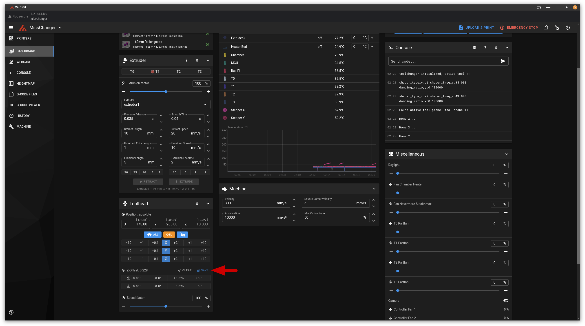
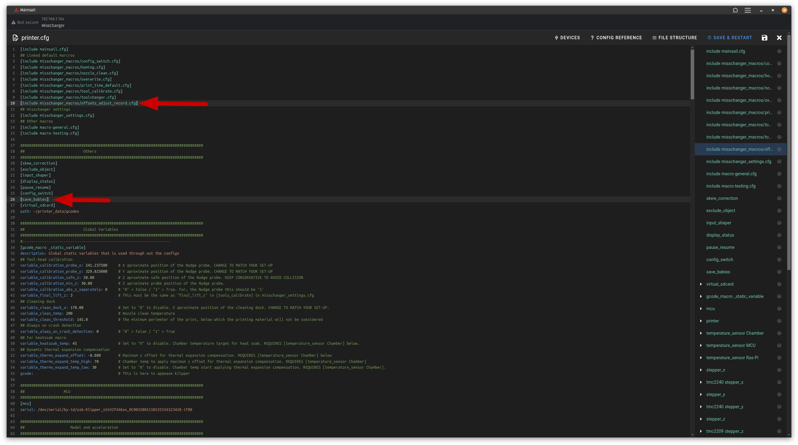

# Feature

This is my proposal for how to implement the ability to save the baby steps that are done via the GUIs or via the command `SET_GCODE_OFFSET` in the Klipper Console.

## Background

Traditionally, for single nozzle tool-head systems, the z-offset can be dialled-in from the various GUIs or via the console with the command `SET_GCODE_OFFSET`. These dialling nudges are often referred to as baby-steps, and the result from which can be saved to the config using the button shown in Screenshot_1, below. This front-end invoke the command `Z_OFFSET_APPLY_PROBE` then `SAVE_CONFIG`.

**Screenshot_1: the save button**

This has not broadly worked for tool-changers that are using (or based on) the vieturz add-ons, so far. That is because `Z_OFFSET_APPLY_PROBE` is not "tool-changer aware" and only save the `z_offset` of the current tool-head to the `[tool_probe_endstop]` object in the config, which is not used in the tool-changer. Further complicating the matter, the `z_offset` parameter for the inactive tool-heads are not visible for both Klipper and the python back-end.

There are operational ways around this issue. The most obvious one of all is to just probe and use the `z_offset` of T0. This method is simpler for the configs can be achieved with just gcode macros, and there will be no need for any additional function to be defined in the back-end. However, doing it this way is limiting in several ways. Chief among which is in how the machine (namely the Voron 2.4 series) is going to handle the out-of-tram gantry, which is after the motors are disabled and the gantry tilts toward the corner / edge that has the higher weight distribution. It is not impossible to do, but it is tedious and / or requires manual intervention.

## How it works

The proposed function here requires 2 files:

* `save_babies.py` - To add the command `SAVE_BABYSTEPS [OFFSET=]` to read the `z_offset` of each tool-head from printer.cfg and save the new `z_offset` using the `TOOL_CALIBRATE_SAVE_TOOL_OFFSET` command.

* `offsets_adjust_record.cfg` - Which contains the steps that are to be done on Klipper side. This includes:
  
  * Capture and store the baby-step value as the `SET_GCODE_OFFSET` command being issued.
  
  * Interject the `Z_OFFSET_APPLY_PROBE` command and run `SAVE_BABYSTEPS [OFFSET=]` before it. The original command, which produced the `#*# [tool_probe_endstop]` section in the config, is preserved; even though it is redundant. This is to avoid any potential compatibility problems with mainline Klipper down the line.

The new files needs to be referenced in printer.cfg, as shows in Screenshot_2.

**Screenshot_2: integration** 

